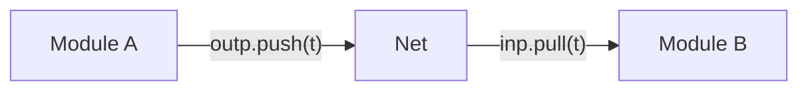
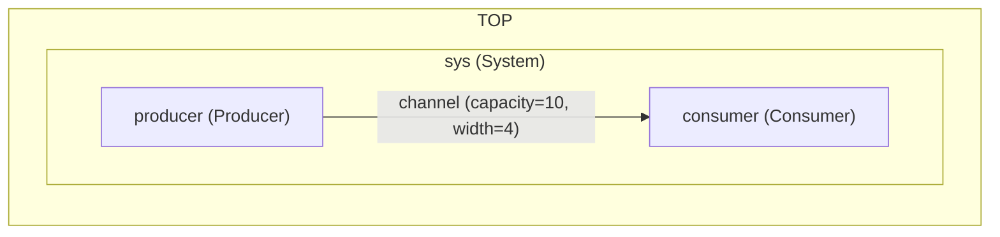

# Data Transfer Between Modules Using Tokens

- Modules communicate by transferring **tokens** over nets. A token is a fixed-size packet of bytes, optionally carrying a typed payload. 

- Nets are passive FIFO buffers: they do not initiate any action. Their state changes only when a module pushes a token onto them or pulls one off via a port. 
Each net must be connected to exactly one outport and one inport.
Nets have a fixed capacity (maximum number of tokens they can hold) and act as First-In-First-Out storage for tokens. A module writes to a net through an `#!sitar outport` and reads from it through an `#!sitar inport` using the `<outport>.push(tok) ` and `<inport>.pull(tok)` methods.



- The net width (in bytes) must match the width declared on both connected ports, and the token type used in push/pull calls must match that width.

- The modeler must follow a discipline to ensure that **`pull()`  must always be performed in phase 0** and **`push()` must always be performed in phase 1**.

---

## The `token<N>` Class

Tokens are instances of the templated `token<N>` class, where `N` is the payload size in bytes:

```sitar
decl $token<>  t0;$    // zero-width: no payload, used as a pure signal
decl $token<1> t1;$    // 1-byte payload
decl $token<4> t4;$    // 4-byte payload (e.g. one int or float)
decl $token<8> t8;$    // 8-byte payload (e.g. two ints, or one double)
```

Every token carries two metadata fields in addition to its payload:

| Field | Type | Default | Purpose |
|-------|------|---------|---------|
| `ID` | `uint64_t` | 0 | Token identifier, set freely by the modeler |
| `type` | `uint8_t` | 0 | Token type tag, set freely by the modeler |

---

## A Minimal Example

Here is a simple example of a token transfer: module `a` sends a single, no-payload token to module `b`. 

``` sitar linenums="1"
--8<-- "docs/sitar_examples/2_basic_concepts_tokens_simple.sitar:model"
```

Expected output:

```
(0,1)TOP.a      :A pushed a token.
(1,0)TOP.b      :B received a token.
Simulation stopped at time (100,0)
```

Notice the one-cycle latency: `a` pushes in phase 1 of cycle 0, and `b` receives in phase 0 of cycle 1. This is the minimum latency for communication across a net, as described in [Timing and Execution](timing_and_execution_model.md).

---

## Pushing and Pulling

**Pushing** a token (in phase 1):

```sitar
//push must happen in phase 1
wait until (this_phase == 1);
$
if (outp.push(t))   // copies t onto the net; returns true if space was available
    log << endl << "pushed: " << t.info();
$;
```

**Pulling** a token (in phase 0):

```sitar
//pull must happen in phase 0
wait until (this_phase == 0);
$
if (inp.pull(t))    // copies from net into t; returns true if a token was available
    log << endl << "pulled: " << t.info();
$;
```

- Both `push` and `pull` are non-blocking, best-effort methods. 
- Both methods take the token object `t` as argument. A `push` copies the value of `t` onto the net, incrementing the net's occupancy by one. If the net was already full to its capacity, the method does not update the net, and returns `false`.    
- A `pull` pops the oldest token on a net (if one exists), decrement's the nets occupancy by one, and copies the value of that token to `t.` If the net was empty, it just returns `false`. 


!!! warning "Phase discipline"
    **Sitar does not enforce phase discipline at runtime.** This is to keep the kernel simple, and to provide flexibility in using different execution schemes for the advanced user for specific models. Calling `push` in phase 0 or `pull` in phase 1 will not raise a runtime error, but may produce incorrect results when the communication graph differs from the sequence in which the modules are executed in each phase. Following the phase discipline ensures that the execution order among modules within a phase does not affect results, enabling deterministic execution and a clean, simple parallelization approach.

	**It is recommended to always push in phase 1 and pull in phase 0 only.**


!!! note "Fixed payload sizes"
    Token width, port width, and net width must all agree at compile time. This is intentional: for the class of synchronous systems Sitar targets, communication channel widths do not change dynamically, and fixed sizes enable efficient, allocation-free data transfer.

---

## Communication Latency of Nets

Nets are intentionally simple: a fixed-capacity FIFO with **no latency parameter**. The **one-cycle minimum latency** for communication between modules arises from the two-phase execution model and is not configurable on the net itself. This keeps the simulation fabric efficient and allocation-free.

Larger integer communication latencies can be modeled by stamping each token with a push timestamp (using the `ID` field or a payload field) and using a conditional pull after inspecting the token at the head of the queue. The `peek` function on an inport allows a module to inspect the front token without consuming it, enabling selective or delayed pulling:
```sitar
$
if (inp.peek(t)) // inspect without consuming
	if (if this_cycle>=(t.ID+delay))// check timestamp
		inp.pull(t); // consume only when ready
$;
```
More complex communication patterns such as priority queues, differential latencies, or custom token filtering can be implemented as dedicated intermediary modules with user-defined behavior. This design keeps the core net implementation simple while leaving modeling flexibility to the user.


## Packing and Unpacking Payload Data

Sitar provides `sitar::pack` and `sitar::unpack` utility functions for serializing and deserializing typed data into a token's byte payload. Multiple values can be packed into a single token in one call, as long as their total size exactly matches the token's payload size (enforced at compile time).


**Packing** one or more values into a token:

```sitar
decl $token<8> t; int a; float b;$    // sizeof(int) + sizeof(float) == 8
$
a = 10; b = 3.14f;
sitar::pack(t, a, b);    // packs a then b sequentially into t's payload
outp.push(t);
$;
```

**Unpacking** values back out in the same order:

```sitar
decl $token<8> t; int a; float b;$
$
if (inp.pull(t))
    sitar::unpack(t, a, b);    // recovers a and b in the same order as pack
$;
```

This works correctly for simple data types (int, float, fixed-size structs, arrays, etc.). For zero-width tokens there is no payload and no pack/unpack is needed.

!!! note "Copy by value"
    Sitar tokens carry data by value. The payload is copied onto the net on push, and copied out on pull. Passing heap-allocated objects or pointers via tokens is strongly discouraged. In parallel simulation, shared heap access across module threads causes cache coherence overhead, correctness issues, and potential segmentation faults. The copy-by-value design keeps communication explicit, safe, and cache-friendly.


---

## A Complete Example

The following example shows a producer pushing integer-valued tokens to a consumer, one per cycle, using `sitar::pack` and `sitar::unpack`. The `t.info()` method is used to log the full token contents at each step. The communication structure is as follows:


The model description:

``` sitar linenums="1"
--8<-- "docs/sitar_examples/2_basic_concepts_tokens.sitar:model"
```

 
The expected output:
```
(0,1)TOP.sys.producer:pushed token: (type=0, ID=0, payload=0x2a 00 00 00 ) value:42
(1,0)TOP.sys.consumer:pulled token: (type=0, ID=0, payload=0x2a 00 00 00 ) value:42
(1,1)TOP.sys.producer:pushed token: (type=0, ID=1, payload=0x2b 00 00 00 ) value:43
(2,0)TOP.sys.consumer:pulled token: (type=0, ID=1, payload=0x2b 00 00 00 ) value:43
(2,1)TOP.sys.producer:pushed token: (type=0, ID=2, payload=0x2c 00 00 00 ) value:44
(3,0)TOP.sys.consumer:pulled token: (type=0, ID=2, payload=0x2c 00 00 00 ) value:44
(3,1)TOP.sys.producer:pushed token: (type=0, ID=3, payload=0x2d 00 00 00 ) value:45
(4,0)TOP.sys.consumer:pulled token: (type=0, ID=3, payload=0x2d 00 00 00 ) value:45
(4,1)TOP.sys.producer:pushed token: (type=0, ID=4, payload=0x2e 00 00 00 ) value:46
(5,0)TOP.sys.consumer:pulled token: (type=0, ID=4, payload=0x2e 00 00 00 ) value:46
Simulation stopped at time (7,0)
```

---

## Token Utility Reference

| Method / Function | Description |
|-------------------|-------------|
| `t.data()` | Returns `uint8_t*` pointer to the raw payload byte array |
| `t.size()` | Returns the payload size in bytes |
| `t.info()` | Returns a formatted string with type, ID and payload bytes. Useful for logging |
| `t.ID` | Token identifier field (`uint64_t`), read/write |
| `t.type` | Token type tag (`uint8_t`), read/write |
| `sitar::pack(t, a, b, ...)` | Serializes one or more basic datatype values into `t`'s payload in order |
| `sitar::unpack(t, a, b, ...)` | Deserializes values back from `t`'s payload in the same order |

---

## What's Next

Proceed to [Execution Model](execution_model.md) to understand how the simulation kernel runs all modules step by step.
