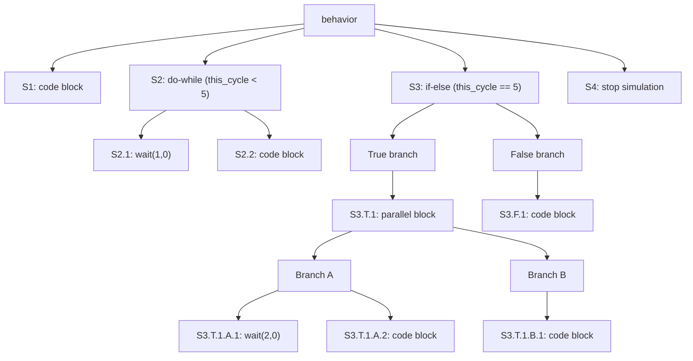
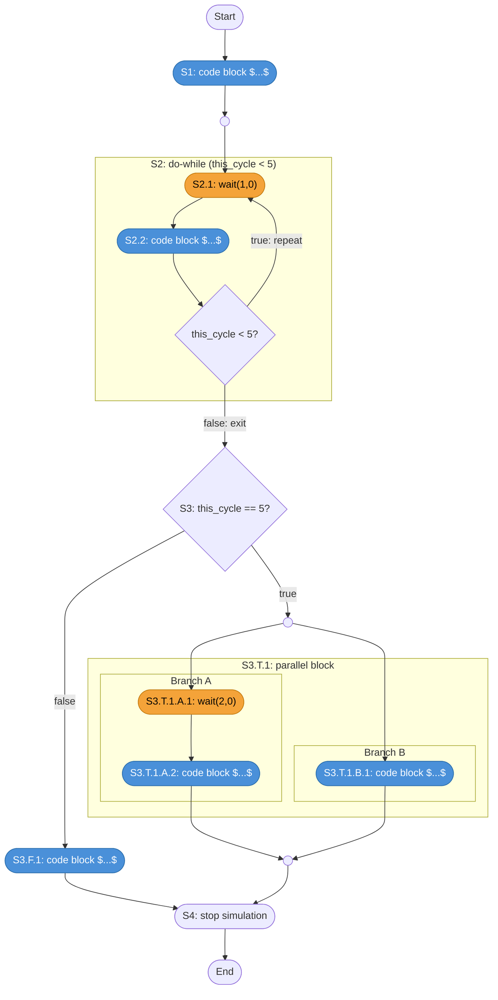

# Module Behavior

A module can take several forms: it may be purely structural, acting as a container for submodule instances; it may have only a `#!sitar behavior` block describing its own actions over time; it may have both submodules and a behavior; or it may have neither, serving as a placeholder. In all cases, the module participates in simulation as a concurrent entity running on the global clock.

```sitar
module A
    // declarations of submodules, nets, ports etc. if present
    ...
    behavior
        statement1;
        statement2;
        statement3;
        ...
    end behavior
end module
```

---

## Behavior as a Sequence

When a module has a `#!sitar behavior` block, that block is a **sequence of statements** separated by semicolons, executing one by one from top to bottom. Some statements are instantaneous. Others (such as `#!sitar wait`) suspend the module for some amount of simulation time. When a module suspends, its full execution state is preserved and control returns to the simulation kernel. When the module is next nudged, execution resumes exactly where it left off.

The same structure applies to `#!sitar procedure` bodies. A procedure is a named, reusable sequence that can be invoked from within a module's behavior using `#!sitar run`. Procedures are described in detail in [Procedures](../3_language_and_examples/procedures.md).

---

## Atomic and Compound Statements

Every statement in a sequence is either **atomic** or **compound**.

An **atomic statement** is a single indivisible action. It either executes instantaneously or suspends the module. Examples:

- `#!sitar $...$` - an embedded C++ code block (instantaneous)
- `#!sitar wait(2,0);` - suspend for 2 cycles
- `#!sitar wait until (this_phase==1);` - suspend until a condition is true
- `#!sitar nothing;` - a no-op (instantaneous)
- `#!sitar stop simulation;` - halt the simulation
- `#!sitar stop behavior;` - halt this module's behavior

A **compound statement** contains one or more nested sequences inside it. Examples:

- `#!sitar if ... then ... else ... end if` - two nested sequences (branches)
- `#!sitar do ... while(...) end do` - one nested sequence (loop body, possibly repeated)
- `#!sitar [ ... || ... ]` - two or more nested sequences running as parallel branches
- `#!sitar run p` - invokes procedure `p`, which wraps a sequence. `#!sitar run` completes only after `p`'s sequence completes. If `p` hits a `#!sitar wait` internally, the entire module suspends until `p` resumes and finishes.

Any level of nesting is allowed. A compound statement's nested sequences are themselves sequences of atomic and compound statements, following the same rules.

---

## An Example

Let's look at a complete, runnable model. Its behavior contains a code block, a do-while loop, an if-else with a parallel block in the true branch, and a stop statement.

``` sitar linenums="1"
--8<-- "docs/sitar_examples/2_basic_concepts_behavior.sitar:model"
```

### The Behavior as a Statement Tree

The nesting structure of the behavior above can be read as a tree, where each node is either a sequence or a statement within it:



### Execution Flow and Suspension Points

The flowchart below traces the execution of the same behavior, showing where the module suspends (wait nodes, in orange) and where it executes instantaneously (code blocks, in blue):



---

## Execution State

Each active sequence has an implicit **execution pointer** tracking where it currently is. When a module suspends at a `#!sitar wait`, all execution pointers across all active nested sequences are preserved, together with all state variables. When the module is next nudged, execution resumes from exactly the right place at every level of nesting. This is conceptually similar to coroutines or generator functions in other languages.

A sequence at any level is in one of four states at any point during simulation:

| State | Meaning |
|-------|---------|
| **Not yet active** | Control has not entered this sequence yet |
| **Active, not converged** | Executing; has not yet hit a `#!sitar wait` in this phase |
| **Active, converged** | Suspended at a `#!sitar wait`; will resume when next nudged |
| **Terminated** | Completed. May be re-activated by its containing statement (e.g. the next iteration of a `#!sitar do-while`) |

!!! note
    A module is considered converged in a phase once every active sequence within it has either hit a `#!sitar wait` or terminated. The kernel moves on to the next module once convergence is reached.

---

## Overview of Statements

The table below gives a brief overview of all available statements. Each is covered in detail with examples in the [Describing Behavior](../3_language_and_examples/sequence.md) section.

| Statement | Type | Description |
|-----------|------|-------------|
| `#!sitar $...$` | atomic | Embedded C++ code block, executes instantaneously |
| `#!sitar wait(c,p)` | atomic | Suspend for `c` cycles and `p` phases |
| `#!sitar wait until (expr)` | atomic | Suspend until condition is true |
| `#!sitar nothing` | atomic | No-op |
| `#!sitar stop simulation` | atomic | Halt entire simulation |
| `#!sitar stop behavior` | atomic | Halt this module's behavior |
| `#!sitar if (condition) then ... else ... ` | compound | Conditional branch |
| `#!sitar do ... while (condition) end do` | compound | Loop |
| `#!sitar [ ... ||... ]` | compound | Parallel block (fork-join) |
| `#!sitar run p` | compound | Invoke procedure `p`; completes when `p` terminates |

Embedded C++ code can also appear in three structural positions outside the behavior block: `#!sitar include $...$` for header includes, `#!sitar decl $...$` for member declarations, and `#!sitar init $...$` for constructor initialization. These are covered in [Code Blocks](../3_language_and_examples/code_blocks.md).

---

## What's Next

Proceed to [Tokens](io_and_tokens.md) to understand how data is transferred between modules over nets.
