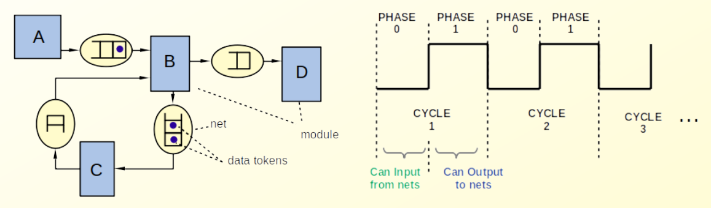
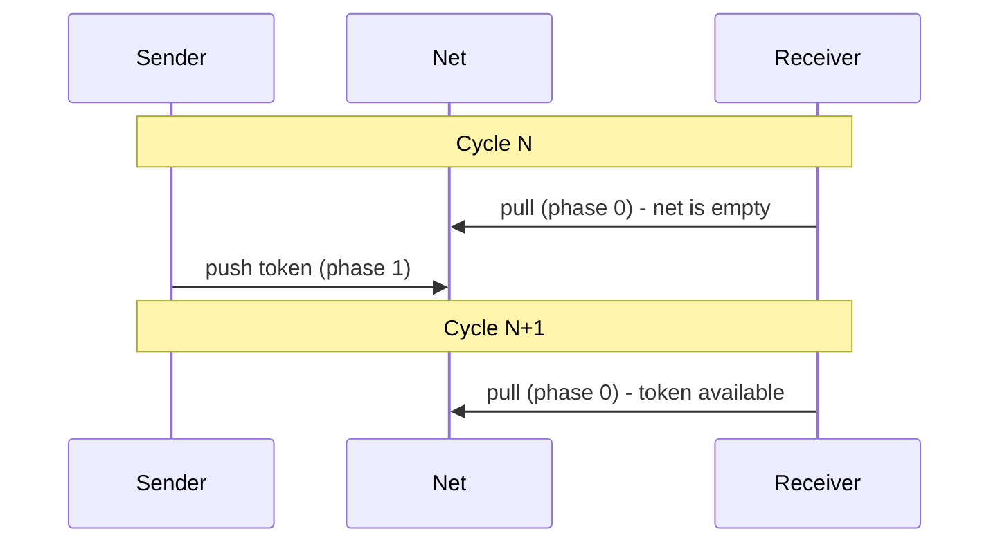

# Time in Sitar

Sitar is a **cycle-based** simulator. Time advances in discrete steps called **clock cycles**. Each cycle is subdivided into exactly two **phases**: phase 0 and phase 1. Simulation time is always expressed as a `(cycle, phase)` pair.

---

## The (cycle, phase) Time Representation

Time advances strictly in the order:

```
(0,0) -> (0,1) -> (1,0) -> (1,1) -> (2,0) -> (2,1) -> ...
```

<!-- FIGURE PLACEHOLDER: sitar_modules_and_time.png - the two-phase clock diagram -->


Inside a model, the current time is accessible as a variable `current_time` within a module. The cycle and phase components can be read individually using `current_time.cycle()` and `current_time.phase()`:

```sitar
$log << endl << "cycle=" << current_time.cycle() << " phase=" << current_time.phase();$;
```

The built-in keywords `current_time`, `this_cycle` and `this_phase` provide direct access:

```sitar
wait until (this_phase == 1);
wait until (this_cycle >= 10);
wait until (current_time >= time(10,0));
```

---

## The Two-Phase Rule

The two-phase subdivision is not just bookkeeping. It encodes a fundamental constraint on module behavior:

!!! important "The Two-Phase Rule"
    A module may only **read** tokens from a net (pull) during **phase 0**. It may only **write** tokens to a net (push) during **phase 1**.

Token transfer between modules uses `push` (write) and `pull` (read) operations on ports. These are described in detail in [Tokens](io_and_tokens.md).

This rule guarantees that within a single cycle, no module can both write to a net and have another module observe that write in the same phase. All state changes to nets occur in a deterministic, race-free order regardless of the sequence in which modules are executed.

A direct consequence of this rule is that communication between two modules over a net always incurs a **minimum latency of one full clock cycle**. A token pushed in phase 1 of cycle N can only be pulled in phase 0 of cycle N+1 or later.


!!! tip "Zero-latency communication"
    Components that must interact with zero latency can be placed together inside a single module as branches of a `#!sitar parallel` block. Within a module, branches execute in a fixed, deterministic order and may run multiple times within a phase until convergence. They are not subject to the one-cycle latency constraint that applies across nets. 

	See [Module Behavior](module_behavior.md) for an overview of parallel blocks, and [Parallel](../3_language_and_examples/parallel.md) for the full details.
---

## Wait Statements

A module suspends its behavior using `#!sitar wait` statements. There are three forms:

| Statement | Meaning |
|-----------|---------|
| `#!sitar wait;` | Advance by one phase (equivalent to `wait(0,1)`) |
| `#!sitar wait(c, p);` | Advance by `c` full cycles and `p` additional phases |
| `#!sitar wait until (expr);` | Suspend until the expression evaluates to true at the start of a phase |

Some examples:

```sitar
wait;           // (0,0) -> (0,1)
wait(1, 0);     // (0,0) -> (1,0)  advance one full cycle
wait(2, 1);     // (0,0) -> (2,1)  advance two cycles and one phase
wait until (this_phase == 1);        // suspend until phase 1
wait until (this_cycle >= 10);       // suspend until cycle 10 or later
wait until (current_time == time(5,0)); // suspend until exactly (5,0)
wait until ($x==10$);	//suspend until the variable x becomes equal to 10
                        //at the start of a phase
```

!!! note
    `#!sitar wait(0,0)` is a zero-delay wait. It does not advance time, but it does yield execution back to the scheduler within the current phase. This is useful inside `#!sitar do-while` loops to prevent an infinite spin within a single phase.

---

## What's Next

Now that we understand when things happen, let's look at how a module describes what it does. Proceed to [Module Behavior](module_behavior.md).
