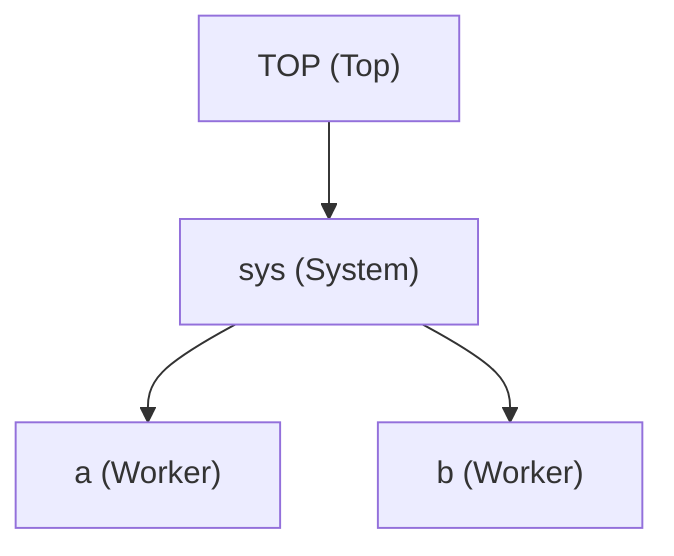

# Modules and hierarchy

This page covers the full syntax for declaring modules, instantiating submodules, using module-level `init`, and navigating the module hierarchy at runtime. For a conceptual introduction to modules and how they relate to nets, see [Modules and Nets](../2_basic_concepts/components_modules_nets.md).

---

## Module declaration

A module is declared with the `module` keyword:

```sitar
module MyModule
    // declarations (submodules, nets, ports) go here
    behavior
        // behavioral statements go here
    end behavior
end module
```

The body may contain submodule declarations, net and port declarations, connection statements, structural `decl`/`init`/`include` blocks, and a `behavior` block. All are optional. A module with none of these is a valid, empty leaf module.

---

## Submodule instantiation

An instance of a named module type is declared with the `submodule` keyword:

```sitar
submodule name : TypeName
```

Multiple instances of the same type can be declared on a single line:

```sitar
submodule a, b, c : Worker    // three independent Worker instances
```

The names `a`, `b`, and `c` are distinct. They share the same type and therefore the same structure and behavior description, but each has its own independent state and its own position in the hierarchy.

---

## The Top module

Every Sitar model has exactly one entry point: a module named `Top`. The simulation kernel instantiates `Top` at startup with the instance name `TOP`. All other modules must be reachable as direct or indirect submodules of `Top`.

```sitar
module Top
    submodule sys : System
end module
```

---

## Module-level `init`

The `init $...$` block at module scope inserts C++ code into the module class constructor. This code runs once, before simulation begins.

A module uses its own `init` to set initial values for its declared member variables:

```sitar
module Worker
    decl $int start_cycle;$
    init $start_cycle = 0;$    // runs in constructor before simulation
    ...
end module
```

A parent module's `init` block can also set fields on its direct submodule instances:

```sitar
module Top
    submodule a, b : Worker
    init
    $
        a.start_cycle = 0;
        b.start_cycle = 3;
    $
end module
```

!!! note
    `init` and `decl` can also appear as statements inside the `behavior` block (with a trailing semicolon). The generated C++ still goes into the class body or constructor, not the `run` function. See [Code blocks](code_blocks.md) for full details.

---

## Hierarchy navigation

Every module has access to the following built-in functions inside any embedded C++ code block:

| Function | Returns | Description |
|---|---|---|
| `instanceId()` | `std::string` | Local instance name within the parent (e.g. `"a"`) |
| `hierarchicalId()` | `std::string` | Full dot-separated name from `TOP` (e.g. `"TOP.sys.a"`) |
| `parent()` | `module*` | Pointer to the structural parent module |
| `getInfo()` | `std::string` | Structural description of this module and all its submodules, recursively |

These are most commonly used in log output and for debugging. The hierarchical name appears automatically in every log line's prefix.

---

## Example

The following example shows a three-level hierarchy (`Top` > `System` > `Worker`), multiple submodule instantiation in one line, module-level `init` in `Top` to set submodule fields, and use of all navigation functions:

``` sitar linenums="1"
--8<-- "docs/sitar_examples/3_modules_hierarchy.sitar:model"
```

The system hierarchy looks like this:



!!! note "Execution order within a cycle"
    The order in which module behaviors execute within a phase is not guaranteed. `sys`, `a`, and `b` all run in phase 0 of cycle 0, but the log output order between them is non-deterministic.

---

## What's next

Proceed to [Nets, ports, and connections](nets_and_ports.md) to learn how to declare communication channels and connect modules together.
