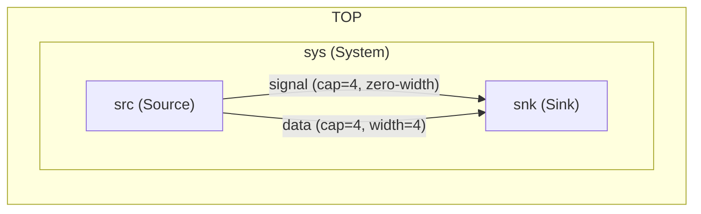

# Nets, ports, and connections

This page covers the full syntax for declaring nets and ports and connecting them. For a conceptual introduction to nets and the one-reader/one-writer rule, see [Modules and Nets](../2_basic_concepts/components_modules_nets.md). For token data transfer over nets, see [Tokens](../2_basic_concepts/io_and_tokens.md).

---

## Nets

A net is declared inside a module using the `net` keyword:

```sitar
net name : capacity N
net name : capacity N width W
```

- `capacity N` — the maximum number of tokens the net can hold simultaneously. `N` must be a positive integer or a parameter expression.
- `width W` — the token payload size in bytes. Omitting `width` means the net carries zero-width tokens (no payload; used as a pure synchronization signal).

Multiple nets of the same type can be declared on one line:

```sitar
net a, b         : capacity 4           // two zero-width nets
net c, d         : capacity 2 width 4   // two 4-byte nets
```

---

## Ports

A port is the interface through which a module reads from (`inport`) or writes to (`outport`) a net:

```sitar
inport  name
outport name
inport  name : width W
outport name : width W
```

Port width must match the width of the net it connects to. A zero-width port (no `width` specifier) must connect to a zero-width net.

Multiple ports of the same type can be declared on one line:

```sitar
inport  a, b           // two zero-width inports
outport c : width 4    // one 4-byte outport
```

---

## Connections

Connections are declared using `=>` (outport to net) or `<=` (inport from net):

```sitar
sender.outp   => channel    // sender's outport writes to channel
receiver.inp  <= channel    // receiver's inport reads from channel
```

Both forms name the same pair of endpoints and are interchangeable. Each net must be connected to exactly one outport and exactly one inport.

### Cross-hierarchy connections

Connection statements may use dot-notation to reach into a submodule tree. The connection is written at the level of the module that declares the net, with port paths reaching as deep as needed:

```sitar
module Top
    submodule x  : X
    submodule sys : System

    net n : capacity 4
    x.outp         => n     // direct child port
    sys.sub.inp    <= n     // port inside a nested submodule
end module
```

---

## Width matching

Net width, outport width, and inport width must all agree. The token type used in push and pull calls must match the declared width. Mismatches are caught at compile time.

| Net declaration | Matching port declaration | Token type |
|---|---|---|
| `net n : capacity 4` | `inport inp`, `outport outp` | `token<>` |
| `net n : capacity 4 width 1` | `inport inp : width 1`, `outport outp : width 1` | `token<1>` |
| `net n : capacity 4 width 4` | `inport inp : width 4`, `outport outp : width 4` | `token<4>` |

---

## Example

The following example declares a pair of zero-width nets and a pair of 4-byte nets, with both connection syntax forms:

``` sitar linenums="1"
--8<-- "docs/sitar_examples/3_nets_and_ports.sitar:model"
```

The communication structure:



---

## What's next

Proceed to [Parameters and templates](parameters_and_templates.md) to learn how to write reusable, configurable module descriptions.
