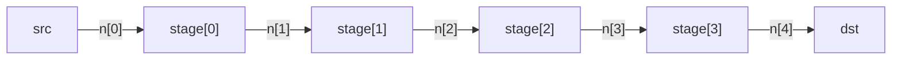

# Regular structures

Sitar provides `submodule_array` and `net_array` for declaring indexed collections of submodules and nets, and a `for` loop for connecting them uniformly. These are the primary tools for building regular, parameterized structures such as pipelines, arrays of processing elements, and meshes.

---

## `submodule_array`

Declares an indexed array of `N` submodule instances of the same type:

```sitar
submodule_array name[N] : TypeName
submodule_array name[N] : TypeName<param1, param2>
```

- `N` must be a positive integer or a parameter expression.
- All instances share the same type and parameter values.
- Individual instances are accessed by index: `name[0]`, `name[1]`, ..., `name[N-1]`.

---

## `net_array`

Declares an indexed array of `N` nets with the same capacity and width:

```sitar
net_array name[N] : capacity C
net_array name[N] : capacity C width W
```

Individual nets are accessed as `name[0]`, `name[1]`, ..., `name[N-1]`.

---

## `for` loops

The `for` loop generates connection statements for a range of integer indices:

```sitar
for i in 0 to (N-1)
    instance[i].outp => net[i]
    instance[i].inp  <= net[i+1]
end for
```

- The loop variable `i` takes values from the lower bound to the upper bound, inclusive.
- The bounds are integer expressions; parameter values may be used.
- The loop body contains only connection statements.

---

## 2D arrays

Both `submodule_array` and `net_array` support two-dimensional declarations:

```sitar
submodule_array node[N][M]       : TypeName<params>
net_array       net_h[N][M-1]   : capacity C width W   // horizontal nets
net_array       net_v[N-1][M]   : capacity C width W   // vertical nets
```

Elements are accessed as `node[i][j]`, `net_h[i][j]`, etc. The two dimensions do not need to be equal. The example above creates a 2D mesh grid of modules connected with horizontal and vertical nets, where the horizontal net array has one fewer column than the node array, and the vertical net array has one fewer row as shown in the figure.


**Nested `for` loops** connect a 2D array:

```sitar
for row in 0 to (N-1)
    for col in 0 to (M-2)
        node[row][col].out_right   => net_h[row][col]
        node[row][col+1].in_left   <= net_h[row][col]
    end for
end for

for row in 0 to (N-2)
    for col in 0 to (M-1)
        node[row][col].out_down    => net_v[row][col]
        node[row+1][col].in_up     <= net_v[row][col]
    end for
end for
```


**Per-instance initialization in a 2D array**: since all instances share the same type and parameters, positional information (row, column IDs) can be passed to each module at construction time via a nested C++ loop in the parent `init` block:

```sitar
init $
for (int i = 0; i < N; i++)
    for (int j = 0; j < M; j++) {
        node[i][j].row = i;
        node[i][j].col = j;
    }
$
```

See the [Mesh example](../4_examples/advanced_examples/mesh.md) for a complete 2D model using this pattern.

---

## Example

The following example builds a parameterized shift register topology: a linear chain of `N` pipeline stages connected by `N+1` nets. The source feeds the first net; the sink reads from the last. Stage, Source, and Sink behaviors are stubs to keep focus on structure.

``` sitar linenums="1"
--8<-- "docs/sitar_examples/3_regular_structures.sitar:model"
```

The structure for `ShiftRegister<4>` looks like this:



Changing the parameter to `ShiftRegister<8>` produces a chain of 8 stages with 9 nets, with no other changes to the description. The `for` loop and array declarations scale automatically.

!!! tip "Net array size"
    A chain of `N` stages needs `N+1` nets — one on each side of every stage. Hence `net_array n[N+1]` and the connection `instance[i].inp <= n[i+1]`.

---

## What's next

With structure covered, proceed to [Sequences and statements](sequence.md) to begin the full behavioral language reference.
