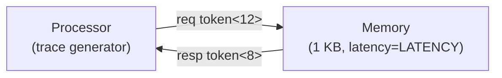

# Processor and memory model

This example models a simple processor-memory system. The processor is a **probabilistic instruction trace generator**: it generates a stream of instructions, each of which unconditionally performs an instruction fetch and optionally performs a data load, a data store, or both (an atomic load-store). The memory is a byte-addressable array that responds to each request after a fixed latency.

The two modules communicate through a **request-response token protocol**: the processor sends a request token and blocks until the memory returns a response token. This models blocking memory access — a natural starting point before introducing features such as out-of-order issue or caches.

**What this example demonstrates:**

- Request-response protocol with two directed nets
- Typed multi-field token payloads with `sitar::pack` / `sitar::unpack`
- Blocking communication: `wait until (port.peek())` to suspend until a response arrives
- Probabilistic behavior using `rand()` in code blocks
- Module-level initialization of a data array in `init`

---

## System overview



The two nets have capacity 1, enforcing strict alternation: the processor issues one request and the memory returns one response before the next request can proceed.

---

## Token formats

```
Request  token<12>:  [ type : 4B | addr : 4B | data : 4B ]
Response token<8> :  [ error : 4B | data : 4B ]
```

The `type` field encodes the operation:

| Value | Name | Description |
|---|---|---|
| 0 | `IFETCH` | Instruction fetch — always issued for every instruction |
| 1 | `LOAD` | Data load only |
| 2 | `STORE` | Data store only |
| 3 | `ATOMIC_LS` | Combined load and store |

The `error` field in the response is 1 if the address is out of bounds; 0 otherwise.

---

## Top-level structure

The system is parameterized at the `System` level. The processor parameters `LOAD_PCT` and `STORE_PCT` are independent integer percentages (0-100): an instruction has probability `LOAD_PCT`% of including a load and independently `STORE_PCT`% of including a store. An instruction with both becomes an `ATOMIC_LS`.

``` sitar linenums="1"
--8<-- "docs/sitar_examples/4_processor_memory.sitar:top"
```

---

## Processor

The processor behavior loops over instructions. For each instruction:

1. **IFETCH** — always send an instruction fetch to the memory at address `pc * 4` and wait for the response.
2. **Probabilistic decision** — independently decide whether to load and/or store, using `rand()` against the percentage thresholds.
3. **Data access** — if a data access is needed, pack the appropriate request token, push it (with retry on backpressure), and wait for the response.

The processor uses member variables (declared in `decl`) for all state so that values persist between code blocks within the same behavior iteration.

``` sitar linenums="1"
--8<-- "docs/sitar_examples/4_processor_memory.sitar:processor"
```

!!! note "Blocking communication"
    `wait until (resp_port.peek())` suspends the processor in place until the memory places a response token on `resp`. The processor makes no forward progress while waiting. This models a blocking memory interface: one outstanding request at a time.

---

## Memory

The memory module holds a 1 KB byte array initialized in `init` with the pattern `mem[i] = i % 256`. It processes one request at a time: pull the request, wait `LATENCY` cycles, perform the read or write, and push the response.

``` sitar linenums="1"
--8<-- "docs/sitar_examples/4_processor_memory.sitar:memory"
```

For a write (`STORE` or `ATOMIC_LS`), the memory copies 4 bytes from the request data field into the array. For a read (`IFETCH`, `LOAD`, or `ATOMIC_LS`), it copies 4 bytes from the array into the response data field. An out-of-bounds address sets `error=1` in the response without modifying the array.

---

## Expected output

With `LOAD_PCT=40`, `STORE_PCT=30`, `NUM_INSTR=5`, `LATENCY=3`, a representative run might look like:

```
(0,1)  TOP.sys.proc : IFETCH  pc=0  addr=0
(3,0)  TOP.sys.mem  : MEM READ   addr=0  data=50462976
(3,0)  TOP.sys.proc : IFETCH OK  data=50462976
(3,1)  TOP.sys.proc : LOAD  addr=64  wdata=0
(6,0)  TOP.sys.mem  : MEM READ   addr=64  data=67438087
(6,0)  TOP.sys.proc : LOAD  OK  rdata=67438087
(6,0)  TOP.sys.proc : --- instr 1 complete ---
(6,1)  TOP.sys.proc : IFETCH  pc=1  addr=4
...
(29,0) TOP.sys.proc : Processor done: 5 instructions executed
Simulation stopped at time (29,0)
```

The exact load/store pattern varies with the random seed. With `srand(42)` the output is deterministic across runs.

!!! tip "Varying the parameters"
    - Set `LOAD_PCT=0` and `STORE_PCT=0` for a pure instruction-fetch workload.
    - Increase `NUM_INSTR` to generate longer traces.
    - Increase `LATENCY` to observe the processor spending more cycles waiting for memory responses.
    - To model a non-blocking processor, separate request issue and response collection into two concurrent branches using a parallel block or a second module.
