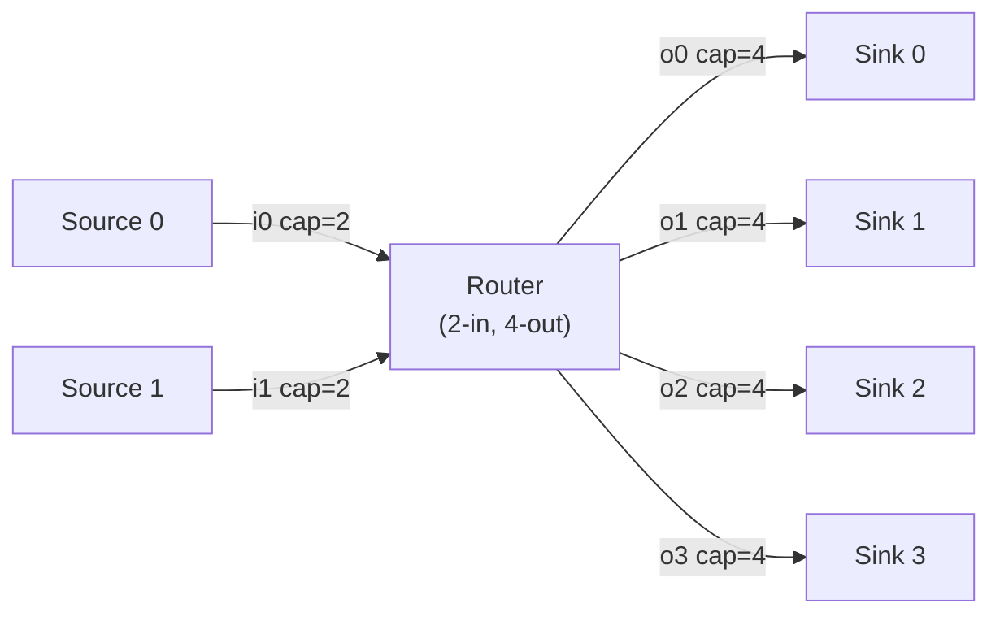

# Router

This example models a packet router with two input ports and four output ports. Incoming packets are forwarded to an output based on the low-order bits of their address field. When both inputs have packets ready in the same cycle, the router uses round-robin arbitration to decide which to serve first.

**What this example demonstrates:**

- Multi-port modules using C++ pointer arrays for indexed port access
- Address-based routing with a compile-time mask `address & (N-1)`
- Round-robin arbitration across input ports
- Per-output buffering via net capacity
- Two-phase routing: arbitrate in phase 0, forward in phase 1

---

## Token format

All ports carry 8-byte tokens encoding two 32-bit integers: an address and a data payload.

```
token<8>:   [ address : 4 bytes | data : 4 bytes ]
```

The destination output port is selected by the low-order bits of the address:

```
dst = address & (N - 1)    // N=4, so low 2 bits; range 0..3
```

---

## Structure

Two Sources inject packets cycling through all four addresses. The Router forwards each packet to the appropriate output net, which acts as the per-output buffer. Four Sinks drain and log received packets.

``` sitar linenums="1"
--8<-- "docs/sitar_examples/4_router.sitar:top"
```



The input nets (`i0`, `i1`) have a small capacity of 2, so back-pressure reaches the Sources quickly when the router stalls. The output nets (`o0`-`o3`) have capacity 4, acting as per-output buffers.

---

## Router module

The Router declares its ports individually and creates C++ pointer arrays in `decl` and `init` to allow indexed access inside code blocks. This is the standard pattern for multi-port modules in Sitar.

``` sitar linenums="1"
--8<-- "docs/sitar_examples/4_router.sitar:router"
```

The routing loop operates in two phases each cycle:

1. **Phase 0 — arbitrate:** Scan inports starting at the round-robin pointer `rr`. The first inport with a token wins. Unpack the address, compute the destination, and advance `rr`.
2. **Phase 1 — forward:** Push the packet to the destination outport. If the output buffer is full, retry each phase until it drains.

!!! note "One packet per cycle"
    The router handles at most one packet per cycle. When neither inport has a token, the router stalls at the phase 0 `wait` until one arrives.

---

## Source

Each Source generates 12 packets (3 per output port), cycling through addresses 0, 1, 2, 3. The two Sources start at different address offsets to create interleaving traffic.

``` sitar linenums="1"
--8<-- "docs/sitar_examples/4_router.sitar:source"
```

---

## Sink

Each Sink drains its output net every phase 0 and logs the address and data of each received packet.

``` sitar linenums="1"
--8<-- "docs/sitar_examples/4_router.sitar:sink"
```

---

## Expected output (excerpt)

```
(0,1) TOP.src0 : src[0] addr=0 data=0
(0,1) TOP.src0 : src[0] addr=1 data=1
(0,1) TOP.src1 : src[1] addr=1 data=0
(1,0) TOP.router : in[0] -> out[0]  addr=0  data=0
(1,0) TOP.router : in[1] -> out[1]  addr=1  data=0
(2,0) TOP.snk0  : snk[0] addr=0 data=0
(2,0) TOP.snk1  : snk[1] addr=1 data=0
...
Simulation stopped at time (...)
```

The round-robin arbiter alternates between `in[0]` and `in[1]` each cycle when both have packets, distributing load evenly across the two sources. Output port utilization depends on the address distribution generated by the Sources — in this example, each output receives exactly 6 packets (3 from each source).
