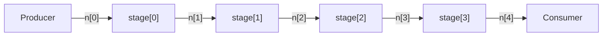

# Shift register

A shift register is a linear pipeline: tokens enter at one end and emerge at the other after a fixed number of stages, each contributing a per-stage delay. This example builds a parameterized, N-stage shift register with typed token payloads.

**What this example demonstrates:**

- `submodule_array` and `net_array` for regular, indexed structure
- `for` loops for parameterized connection generation
- `sitar::pack` and `sitar::unpack` for typed integer payloads
- Phase-disciplined token flow: pull in phase 0, push in phase 1
- Back-pressure handling with retry loops

---

## Structure

The `ShiftRegister` module is parameterized on depth `N` and per-stage latency `DELAY`. The top-level instantiation `ShiftRegister<4>` creates four stages each with a 1-cycle delay, giving a total pipeline depth of 4 cycles.

``` sitar linenums="1"
--8<-- "docs/sitar_examples/4_shift_register.sitar:structure"
```

The resulting topology for `ShiftRegister<4>`:



---

## Token payload: pack and unpack

Tokens carry a 4-byte integer payload. The Producer packs each counter value before pushing; the Consumer unpacks after pulling.

```
token<4> t;
int val = 42;
sitar::pack(t, val);     // serialize val into t's 4-byte payload

sitar::unpack(t, val);   // deserialize back into val
```

`sitar::pack` and `sitar::unpack` accept any number of arguments; the total `sizeof` of all arguments must match the declared token width at compile time.

---

## Producer

The Producer generates tokens 0, 1, 2, ... and pushes as many as the output net will accept each phase. `push()` returns `false` when the net is full; the inner `while` loop stops and the module advances to the next phase.

``` sitar linenums="1"
--8<-- "docs/sitar_examples/4_shift_register.sitar:producer"
```

---

## Pipeline stage

Each Stage pulls one token in phase 0, waits `DELAY` cycles, then pushes in phase 1. Both pull and push are written as retry loops: if the operation fails (net empty or full), the module advances one phase and tries again.

``` sitar linenums="1"
--8<-- "docs/sitar_examples/4_shift_register.sitar:stage"
```

!!! note "Phase discipline"
    The `wait until (this_phase == 0)` and `wait until (this_phase == 1)` guards ensure reads and writes occur in the correct phase. A Stage that pulls a token at cycle `c`, phase 0 and delays by `DELAY=1` cycles will push it at cycle `c+1`, phase 1.

---

## Consumer

The Consumer drains all available tokens in phase 0 each cycle, unpacking and logging each value. Simulation stops when `NUM_TOKENS` values have been received.

``` sitar linenums="1"
--8<-- "docs/sitar_examples/4_shift_register.sitar:consumer"
```

---

## Expected output

With `N=4`, `DELAY=1`, and `NUM_TOKENS=6`, the first token arrives at the Consumer after 4 pipeline stages (approximately cycle 5):

```
(0,1)  TOP.S.prod :  sent 0
(0,1)  TOP.S.prod :  sent 1
(0,1)  TOP.S.prod :  sent 2
...
(5,0)  TOP.S.cons :  received 0
(6,0)  TOP.S.cons :  received 1
(7,0)  TOP.S.cons :  received 2
...
Simulation stopped at time (10,0)
```

Changing the instantiation to `ShiftRegister<8>` extends the pipeline to 8 stages; no other change to the model is needed.
