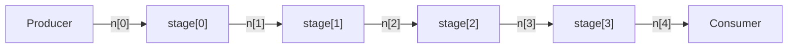

# Shift register

A shift register is a linear pipeline: tokens enter at one end and emerge at the other after a fixed number of stages, each contributing a per-stage delay. This example builds a parameterized, N-stage shift register with typed token payloads.

**What this example demonstrates:**

- `submodule_array` and `net_array` for regular, indexed structure
- `for` loops for parameterized connection generation
- `sitar::pack` and `sitar::unpack` for typed integer payloads
- Phase-disciplined token flow: pull in phase 0, push in phase 1
- Back-pressure handling with retry loops

---

## Structure

The `ShiftRegister` module is parameterized on depth `N` and per-stage latency `DELAY`. The top-level instantiation `ShiftRegister<4>` creates four stages each with a 1-cycle delay, giving a total pipeline depth of 4 cycles.

``` sitar linenums="1"
--8<-- "docs/sitar_examples/4_shift_register.sitar:structure"
```

The resulting topology for `ShiftRegister<4>`:


```mermaid
flowchart LR
    prod["Producer"]
    s0["stage[0]"]
    s1["stage[1]"]
    s2["stage[2]"]
    s3["stage[3]"]
    cons["Consumer"]
    prod -->|"n[0]"| s0
    s0  -->|"n[1]"| s1
    s1  -->|"n[2]"| s2
    s2  -->|"n[3]"| s3
    s3  -->|"n[4]"| cons
```

---

## Token payload: pack and unpack

Tokens carry a 4-byte integer payload. The Producer packs each counter value before pushing; the Consumer unpacks after pulling.

```
token<4> t;
int val = 42;
sitar::pack(t, val);     // serialize val into t's 4-byte payload

sitar::unpack(t, val);   // deserialize back into val
```

`sitar::pack` and `sitar::unpack` accept any number of arguments; the total `sizeof` of all arguments must match the declared token width at compile time.

---

## Producer

The Producer generates tokens 0, 1, 2, ... and pushes as many as the output net will accept each phase. `push()` returns `false` when the net is full; the inner `while` loop stops and the module advances to the next phase. With `n[0]` declared at `capacity 1`, this means at most one token per phase: the loop pushes once, the net becomes full, and the next `push()` fails immediately.

``` sitar linenums="1"
--8<-- "docs/sitar_examples/4_shift_register.sitar:producer"
```

---

## Pipeline stage

Each Stage pulls one token in phase 0, waits `DELAY` cycles, then pushes in phase 1. Both pull and push are written as retry loops: if the operation fails (net empty or full), the module advances one phase and tries again.

``` sitar linenums="1"
--8<-- "docs/sitar_examples/4_shift_register.sitar:stage"
```

!!! note "Phase discipline"
    The `wait until (this_phase == 0)` and `wait until (this_phase == 1)` guards ensure reads and writes occur in the correct phase. A Stage that pulls a token at cycle `c`, phase 0 and delays by `DELAY=1` cycles will push it at cycle `c+1`, phase 1.

---

## Consumer

The Consumer drains all available tokens in phase 0 each cycle, unpacking and logging each value. Simulation stops when `NUM_TOKENS` values have been received.

``` sitar linenums="1"
--8<-- "docs/sitar_examples/4_shift_register.sitar:consumer"
```

---

## Expected output

With `N=4`, `DELAY=1`, and `NUM_TOKENS=6`:

```
(0,1)  TOP.S.prod :  sent 0
(1,1)  TOP.S.prod :  sent 1
(3,1)  TOP.S.prod :  sent 2
(5,1)  TOP.S.prod :  sent 3
(7,1)  TOP.S.prod :  sent 4
(9,0)  TOP.S.cons :  received 0
(9,1)  TOP.S.prod :  sent 5
(11,0) TOP.S.cons :  received 1
(13,0) TOP.S.cons :  received 2
(15,0) TOP.S.cons :  received 3
(17,0) TOP.S.cons :  received 4
(19,0) TOP.S.cons :  received 5
Simulation stopped at time (19,1)
```

The first token takes 9 cycles to cross the pipeline: each of the 4 stages contributes 1 cycle of net latency (pull is only visible one cycle after the matching push) plus `DELAY=1` cycle of processing, and the final net hop into the Consumer adds one more cycle. After token 0 and token 1 (pushed back-to-back at `(0,1)` and `(1,1)`, since `n[0]` is still empty for both), `n[0]`'s capacity-1 buffer is occupied for 2 cycles per token (1 cycle of net latency before stage 0 can pull it, plus its own `DELAY=1`), so the Producer can push only once every 2 cycles thereafter: `sent 2` at `(3,1)`, `sent 3` at `(5,1)`, and so on. Once the pipeline is full, the Consumer receives one token every 2 cycles, alternating phase 0 (receive) and phase 1 (producer send).

Changing the instantiation to `ShiftRegister<8>` extends the pipeline to 8 stages; no other change to the model is needed, though the per-token latency and the simulation's stop time will increase accordingly.
