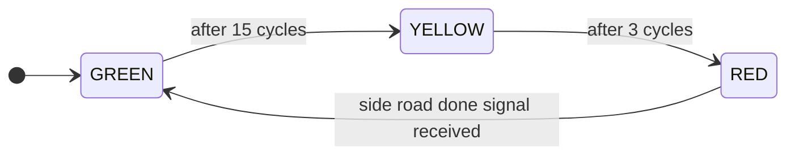
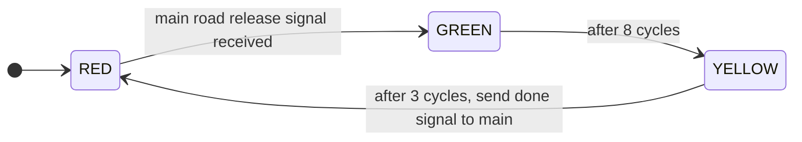
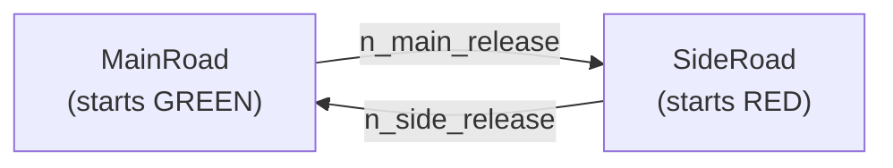

# State machine: traffic light controller

This example models the traffic light controller of a two-road intersection as a pair of interacting **Moore-type synchronous state machines**.

A Moore machine's output is determined solely by its current state. Each module logs its light color on every state transition, and the only information exchanged between the two machines is a zero-width synchronization signal: who has the right of way.

**What this example demonstrates:**

- Moore FSM modeling with `enum` state variables in `decl`
- Inter-module synchronization via zero-width signal tokens
- State-based timing with `wait(N, 0)`
- Coordinated behavior across two concurrently running modules

---

## Problem description

A main road and a side road share an intersection. The controller enforces the following cycle, with the main road getting priority (longer green phase):

| Phase | Duration |
|---|---|
| Main GREEN | 15 cycles |
| Main YELLOW | 3 cycles |
| Side GREEN | 8 cycles |
| Side YELLOW | 3 cycles |

The side road stays RED while the main road is active. The two FSMs coordinate through handshake signals: Main tells Side when it has cleared the intersection, and Side acknowledges when it has done the same.

---

## State diagrams



**Main road FSM** (starts GREEN)



**Side road FSM** (starts RED)

---

## Structure

The `TrafficController` module instantiates both FSMs and wires them together with two zero-width nets — one for each direction of the handshake.

``` sitar linenums="1"
--8<-- "docs/sitar_examples/4_state_machine.sitar:top"
```



---

## Main road FSM

The module cycles through GREEN, YELLOW, and RED states using `if` blocks on a `State` enum. The `wait(N, 0)` inside each state produces the timed dwell. On entering RED, the module pushes a zero-width signal token to Side (blocking retry until the push succeeds), then suspends until it receives Side's acknowledgement.

``` sitar linenums="1"
--8<-- "docs/sitar_examples/4_state_machine.sitar:main_fsm"
```

!!! note "Moore property"
    The `log` statement at the entry of each state represents the Moore output: the light color depends only on the value of `state`, with no reference to any input signal.

---

## Side road FSM

Side starts in RED and blocks on `wait until (from_main.peek())`. Once Main releases it, Side completes its GREEN-YELLOW-RED cycle and replies with its own signal token.

``` sitar linenums="1"
--8<-- "docs/sitar_examples/4_state_machine.sitar:side_fsm"
```

---

## Expected output

```
(0,0)  TOP.ctrl.main : [MAIN] GREEN  (main=GREEN  side=RED)
(15,0) TOP.ctrl.main : [MAIN] YELLOW (main=YELLOW side=RED)
(18,0) TOP.ctrl.main : [MAIN] RED -- releasing side road
(19,0) TOP.ctrl.side : [SIDE] RED -- waiting for main
(19,0) TOP.ctrl.side : [SIDE] GREEN  (main=RED  side=GREEN)
(27,0) TOP.ctrl.side : [SIDE] YELLOW (main=RED  side=YELLOW)
(30,0) TOP.ctrl.side : [SIDE] RED -- releasing main
(31,0) TOP.ctrl.main : [MAIN] GREEN  (main=GREEN  side=RED)
...
Simulation stopped at time (93,...)
```

The simulation runs for three complete main-road sequences (controlled by `seq >= 3` in `MainRoad`). One complete cycle — Main green through Side red — spans 15 + 3 + 8 + 3 = 29 cycles plus one cycle of handshake overhead.

!!! tip "Extending the model"
    To add a third road or a pedestrian crossing phase, introduce additional FSM modules and extend the handshake chain. Each FSM remains purely Moore: only its own state determines its output, and all coordination is via explicit signal tokens.
