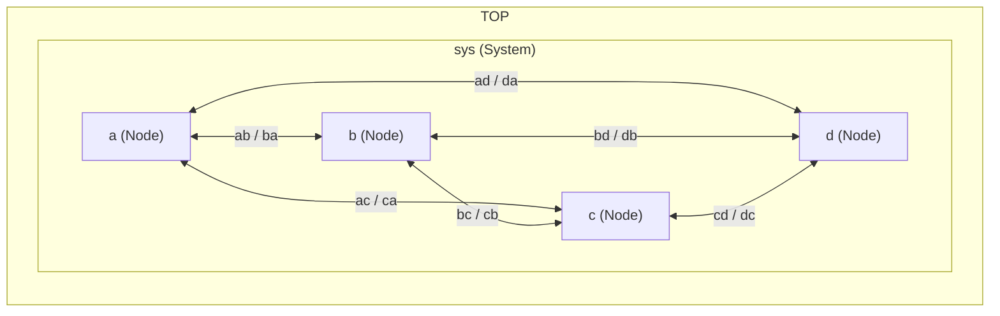

# Parallel Execution

Sitar supports shared-memory parallel simulation via OpenMP. The two-phase execution model maps naturally onto a parallel loop: all modules are independent within each phase (no module reads what another writes in the same phase), so every module in a phase can run on a separate thread. A single barrier between phases is all that is needed for correctness.

This page covers how to enable parallel execution, how to measure speedup, and how to customize the mapping of modules to threads.

---

## How Parallelism Works in Sitar

The default simulation loop (in `sitar_default_main.cpp`) runs as follows in parallel mode:

```
for each (cycle, phase):
    #pragma omp for  -- each thread runs a subset of modules
    #pragma omp barrier  -- all threads synchronize before next phase
```

The `flattenHierarchy` function collects all modules into a flat list. OpenMP distributes that list across threads using a static schedule (round-robin by default). The barrier after each phase enforces the read/write discipline: no module begins the next phase until all modules have completed the current one.

Because modules are independent within a phase by construction (the two-phase rule prohibits same-phase read-write conflicts), no locks or shared state are needed inside the loop.

---

## A Simple Example

The following model has four modules connected in a clique. Each module burns approximately 1 ms of CPU time per phase using a busy-wait loop, and sends a token to a randomly chosen neighbour every `COMM_INTERVAL` cycles.

``` sitar linenums="1"
--8<-- "docs/sitar_examples/5_parallel_simple.sitar:model"
```

The communication structure:



### Compiling and Running

Compile without OpenMP for a serial baseline:

```bash
sitar translate 5_parallel_simple.sitar
sitar compile --no-logging
time ./sitar_sim 20
```

Then compile with OpenMP and compare:

```bash
sitar compile --openmp --no-logging
export OMP_NUM_THREADS=4
time ./sitar_sim 20
```

The `time` command reports wall-clock elapsed time. With 4 modules each doing ~2 ms of work per cycle (1 ms per phase), the serial run takes approximately `20 cycles x 2 ms = 40 ms`. With 4 threads you should see close to 4x speedup, approaching 10 ms.

### Setting the Number of Threads

The number of threads is controlled by the `OMP_NUM_THREADS` environment variable:

```bash
export OMP_NUM_THREADS=1   # effectively serial
export OMP_NUM_THREADS=2
export OMP_NUM_THREADS=4   # one thread per module for this example
```

Set `OMP_NUM_THREADS` to the number of modules (or a divisor of it) for best load balance with the default static schedule.

---

## Customizing Module-to-Thread Mapping

By default, `flattenHierarchy` collects every module in the hierarchy — including container modules that have no ongoing behavior — and distributes them round-robin across threads. For most models this is fine, but for large regular structures (such as an N×M mesh) it is more efficient to run only the leaf compute modules in parallel and leave structural container modules out of the list entirely.

To do this, supply a custom `main.cpp` at compile time:

```bash
sitar compile -m custom_main.cpp --openmp --no-logging
```

### Selecting specific modules by name

For small models with named submodules, build the list explicitly:

```cpp
vector<module*> modules_to_run;
modules_to_run.push_back(&TOP->sys.a);
modules_to_run.push_back(&TOP->sys.b);
modules_to_run.push_back(&TOP->sys.c);
modules_to_run.push_back(&TOP->sys.d);
```

With `OMP_NUM_THREADS=2` and `schedule(static)`, OpenMP assigns the first half of the list to thread 0 and the second half to thread 1.

### Selecting all children of a parent (for arrays)

For models that use `submodule_array` — where individual instances cannot be named explicitly in C++ — iterate over the parent module's `_submodules` map instead:

```cpp
void buildModuleList(vector<sitar::module*>* list, sitar::module* parent)
{
    for (auto it = parent->_submodules.begin();
              it != parent->_submodules.end(); ++it)
        list->push_back(it->second);
}

// In main, after instantiating TOP:
vector<sitar::module*> modules_to_run;
buildModuleList(&modules_to_run, &(TOP->system));
```

This adds all direct children of `system` (i.e., all `node[i][j]` instances in a mesh) without naming them individually. `TOP` and `system` are left out of the list; they run implicitly via `runHierarchical` in serial mode, or are simply unused if they have no ongoing behavior.

For a two-level hierarchy (e.g., the children of `system` are themselves arrays), call `buildModuleList` recursively or iterate two levels deep as needed.

---

## Important Considerations

### Logging in Parallel Mode

In parallel execution, multiple modules run concurrently. Writing to a shared output stream (such as `std::cout`) from multiple threads simultaneously will interleave log lines unpredictably. Sitar handles this by assigning each module its own log file in parallel mode:

```cpp
string log_name = modules_to_run[i]->hierarchicalId() + "_log.txt";
logstreams[i]->open(log_name.c_str());
modules_to_run[i]->log.setOstream(logstreams[i]);
```

This produces one log file per module (e.g. `TOP.sys.a_log.txt`, `TOP.sys.b_log.txt`, etc.), each written exclusively by one module. The files can be inspected individually or merged and sorted by timestamp after simulation.

!!! warning
    Never share a single output stream across modules in parallel mode. Even if individual `<<` calls are individually atomic, multi-field log lines will interleave across threads, producing unreadable output.

### Random Number Generation

If your modules use random number generation, each module must use its own independent random number generator. Sharing a single generator across threads without locking causes data races and non-deterministic (and incorrect) results.

The recommended pattern is to declare a generator as a member of each module and seed it uniquely before simulation starts:

```sitar
decl $int seed;$
init $seed = 0;$
```

Then in the main, before the parallel loop, assign a unique seed to each module:

```cpp
TOP->sys.a.seed = 101;
TOP->sys.b.seed = 202;
TOP->sys.c.seed = 303;
TOP->sys.d.seed = 404;
```

Inside the module behavior, use `seed` (combined with `this_cycle` for additional variation if needed) to initialize calls to `srand` / `rand` or any other generator:

```sitar
$srand(seed + (int)this_cycle);$;
```

!!! warning
    Do not use a global `srand` call or a shared `rand()` in parallel simulation. Each execution thread must have its own generator state, seeded independently.

---

## What's Next

Return to the [Language and Examples](../3_language_and_examples/sequence.md) section to learn the full Sitar modeling language, or jump directly to [Advanced Examples](../4_examples/advanced_examples/processor_model.md) for complete working models.
