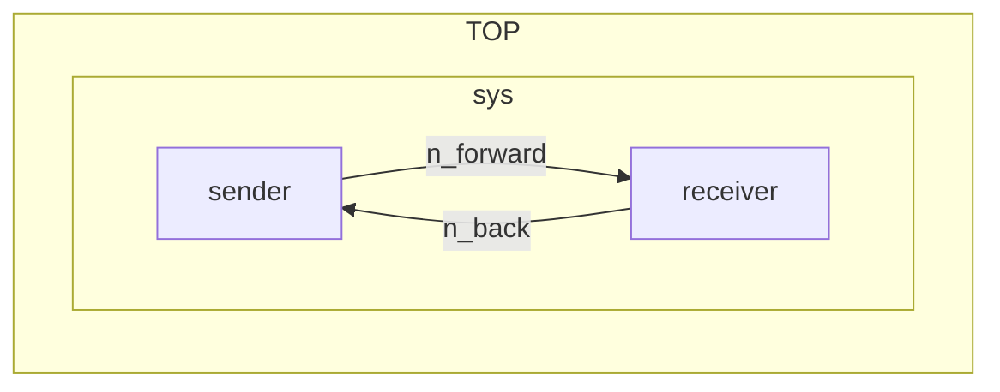
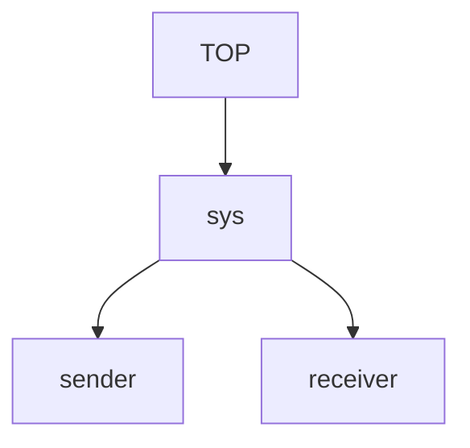
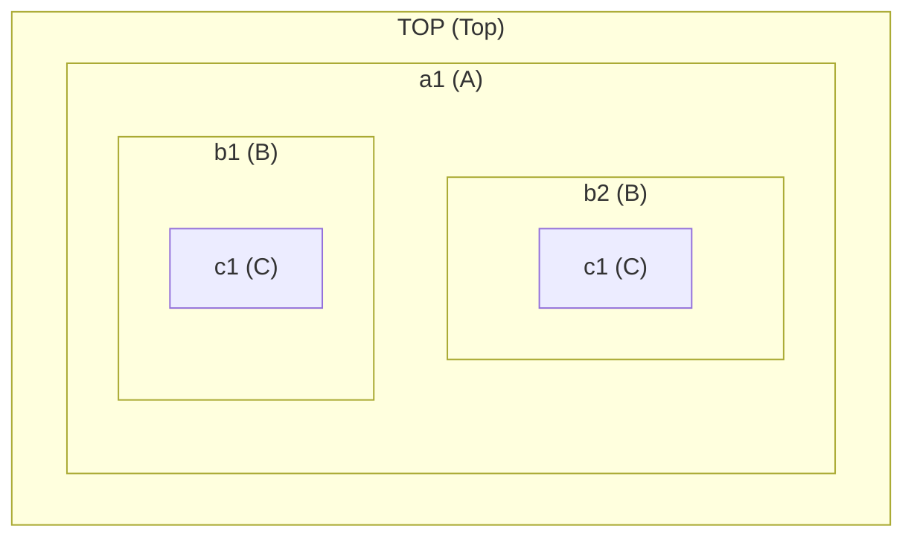

# Modules and Nets

A Sitar model describes a system as a set of concurrent **modules** communicating over buffered channels called **nets**. These are the only two structural primitives in Sitar.

---

## Modules

A module is an active, concurrent entity in the system. All modules run concurrently on a single global clock. A module can optionally contain a `#!sitar behavior` block describing its actions over time, and it can contain instances of other modules, making the description hierarchical.

Every Sitar model must contain exactly one module named `#!sitar Top`. It is the root of the module hierarchy that is instantiated by the simulator with an instance name `TOP`, and is the entry point for simulation.

A module is declared as follows:

```sitar
module ModuleName
    // structure and behavior go here
end module
```

Instances of one module inside another are declared using the `#!sitar submodule` keyword:

```sitar
submodule instance_name : ModuleType
```

Multiple instances of the same type can be declared on one line:

```sitar
submodule a, b, c : SomeModule
```

---

## Nets

A net is a passive, buffered FIFO channel. It carries data tokens between modules. Nets have two key attributes:

- **capacity**: the maximum number of tokens the net can hold at any time.
- **width**: the size of each token's data payload in bytes (default is 0, meaning tokens carry no payload).

A net is declared inside a module:

```sitar
net net_name : capacity 4
net net_name : capacity 4 width 2
```

!!! note "One reader, one writer"
    Each net must be connected to exactly one `#!sitar outport` (writer) and exactly one `#!sitar inport` (reader). This restriction is what makes the two-phase execution deterministic and race-free.

---

## Ports and Connections

A module's interface to a net is through **ports**. A port is either an `#!sitar inport` (for reading tokens) or an `#!sitar outport` (for writing tokens). Ports are declared inside the module they belong to:

```sitar
inport  inp1
outport outp1
inport  inp2  : width 4
outport outp2 : width 2
```

The port width must match the width of the net it connects to.

Connections between ports and nets are written using `#!sitar =>` (outport to net) and `#!sitar <=` (inport from net):

```sitar
sender.outp   => n_forward    // sender's outport writes to n_forward
receiver.inp  <= n_forward    // receiver's inport reads from n_forward
```

---

## A Structural Example

The following example shows two modules connected by two nets, forming a bidirectional channel. Neither module has any behavior yet; this example focuses purely on structure.

``` sitar linenums="1"
--8<-- "docs/sitar_examples/2_basic_concepts_structure.sitar:model"
```

The system structure looks like this:


Translating, compiling and running this description will simply produce the following:
```
(0,0)TOP.sys.receiver:Receiver running.
(0,0)TOP.sys.sender:Sender running. 
Simulation stopped at time (100,0)
```

---

## Hierarchy

Modules can be nested to any depth. A module may contain submodules, which in turn contain their own submodules, forming a tree rooted at `#!sitar TOP`. Nets and connections are declared at the level that has visibility to both endpoints.



The hierarchical name of a module instance is formed by joining instance names from root to leaf with dots. For example, the `Sender` module used in our model above has the hierarchical name `TOP.sys.sender`. This name appears automatically in log output. It can also be accessed explicitly using the following built-in functions available inside any embedded C++ block:

- `instanceId()` returns the instance name of the calling module within its parent (e.g. "sender").
- `hierarchicalId()` returns the full dot-separated hierarchical name (e.g. "TOP.sys.sender").
- `parent()` returns a pointer to the calling module's structural parent.
- Child modules can be referenced directly by their instance name (e.g. `sys.getInfo()`).
- `getInfo()` returns a string containing the structural information of a module and all of its children, recursively. Calling it inside the behavior of `Top` prints the entire system hierarchy.

---

Here is a simple example illustrating hierarchy and the use of our built-in functions. `TOP` contains `a1` (of type `A`). `a1` contains `b1` and `b2` (of type `B`). Each `B` instance contains its own `c1` (of type `C`), so the full hierarchy has five modules below `TOP`.



``` sitar linenums="1"
--8<-- "docs/sitar_examples/2_basic_concepts_structure_2.sitar:model"
```

Note that `b1` and `b2` are both instances of type `B`. Since `B` declares `c1` as a submodule, each instance gets its own independent `c1`. Their hierarchical names are `TOP.a1.b1.c1` and `TOP.a1.b2.c1` respectively. Instance names are unique within a parent. The same module type can be instantiated multiple times anywhere in the hierarchy.


!!! tip 
    A module need not have a `#!sitar behavior` block. Structural modules that exist only to group submodules and declare nets are perfectly valid.

---


## Connecting Ports Across Hierarchy Levels

Nets and port connections are generally declared at the level of the module that owns the net. This means that to connect a port of one submodule directly to a port of a deeply nested submodule, the net is declared at the common ancestor level and both ports are connected there directly. For example, to connect `TOP.x.outp` to `TOP.a1.b1.c1.inp`, the net is declared in `Top` and both endpoints are wired there:

```sitar
module Top
    submodule x  : X
    submodule a1 : A

    net n : capacity 4
    x.outp        => n
    a1.b1.c1.inp  <= n
end module
```

Port paths in connection statements use dot notation to reach into the hierarchy. For example, `a1.b1.c1.inp` names the `inp` port of instance `c1` inside `b1` inside `a1`, all relative to the module where the connection is declared.
!!! note 
	This manner of connecting ports across structural hierarchy levels adds simplicity but breaks description modularity. A port mapping construct is planned to be added in future versions of Sitar.

---

## What's Next

With the structural picture in place, let's look at how time works in Sitar. Proceed to [Timing](timing_and_execution_model.md).
