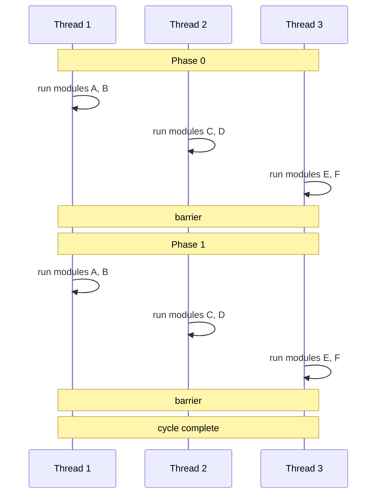

# Execution Model

The previous pages introduced modules, nets, time, behavior, and tokens. This page ties them together by explaining how the Sitar simulation kernel actually runs a model step by step.

---

## What "Running a Module" Means

Each module has a `run(cycle, phase)` function generated from its behavior block. Calling `run()` on a module **nudges** it: execution proceeds through the behavior until the next `#!sitar wait` statement is reached, at which point the module suspends and control returns to the kernel. The module's execution state (its position in the behavior, all local variables) is preserved between calls.

For a **hierarchical module** (one that contains submodules), `run()` first executes the module's own behavior until a wait, then calls `run()` on each child submodule in turn. This happens recursively down the hierarchy.

!!! note
    The kernel only maintains a flat list of all leaf-level modules. The recursive execution through the hierarchy is handled by each module's generated `run()` function. From the kernel's perspective, it simply calls `run()` on the top-level module once per phase.

---

## The Sequential Execution Loop

The basic simulation loop is straightforward:

```c
cycle = 0
while (cycle < simulation_end_time)
{
    phase = 0
    for each module m:
        m.run(cycle, phase)

    phase = 1
    for each module m:
        m.run(cycle, phase)

    cycle = cycle + 1
}
```

Every module is run exactly once per phase. The execution order among modules within a phase does not affect the result. This is guaranteed by the two-phase rule: in phase 0 all modules only read from nets; in phase 1 all modules only write to nets. There are no read-write or write-write conflicts between modules within a phase.

!!! important "Why ordering doesn't matter"
    Because nets can only be read in phase 0 and written in phase 1, no module can observe another module's output from the same phase. All reads see the state of nets as of the end of the previous phase. This is precisely what makes the execution order irrelevant and parallelization straightforward.

---

## Parallel Execution with OpenMP

Since execution order among modules is irrelevant within a phase, the loop over modules can be parallelized trivially. Sitar uses OpenMP for this:

```c
cycle = 0
while (cycle < simulation_end_time)
{
    phase = 0
    #pragma omp for
    for (m = 0; m < num_modules; m++)
        module[m].run(cycle, phase)
    #pragma omp barrier

    phase = 1
    #pragma omp for
    for (m = 0; m < num_modules; m++)
        module[m].run(cycle, phase)
    #pragma omp barrier

    cycle = cycle + 1
}
```

The modules are distributed across threads by OpenMP's scheduler (either dynamically, or according to a static mapping specified by the modeler). All threads synchronize at the end of each phase via a barrier. No locks or critical sections are needed for net access, since the two-phase rule guarantees at most one writer and one reader per net per phase.



!!! tip "Enabling parallel execution"
    Parallel execution requires no changes to the model. Compile with the `--openmp` flag:
    ```bash
    sitar compile --openmp
    ```
    See [Enabling Parallel Execution](parallel_execution.md) for details on thread mapping and performance tuning.

---

## Modeling Scope and the Moore Restriction

A consequence of the two-phase rule is that Sitar can only model systems where every path from a module's input to its output passes through at least one net (and therefore incurs at least one cycle of latency). This is equivalent to requiring that all inter-module communication is through **Moore-type** components: components whose outputs depend only on their state at the start of a cycle, not on their inputs within the same cycle.

This restriction rules out purely combinational (zero-latency) paths between separate modules. Such paths can still be modeled by placing the interacting components within a single module as branches of a `#!sitar parallel` block, where execution order is fixed and deterministic.

!!! note "Summary"
    Sitar's execution model can be stated in one sentence: run every module once in phase 0, synchronize, run every module once in phase 1, synchronize, and advance the cycle. The two-phase read/write discipline makes this loop correct, deterministic, and trivially parallelizable.
