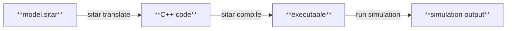

# Getting Started

Let's walk through installing Sitar, understanding the toolchain, and running your first simulation.

---

## Prerequisites

Sitar runs on **Linux** (tested on Ubuntu 18.04, 20.04, and 22.04). The following tools must be available:

| Tool | Purpose |
|------|---------|
| Python 3 | Installation script |
| SCons | Build system used during installation |
| gcc >= 4.5 | Compiling translated C++ model code |
| OpenMP | Parallel simulation (included with gcc by default) |

On Ubuntu/Debian:

```bash
sudo apt-get install python3 scons gcc
```

---

## Installation

**1. Clone the repository:**

```bash
git clone https://github.com/sitar-sim/sitar.git
cd sitar
```

**2. Run the installation script:**

```bash
./install.py
```

This builds the Sitar translator using the bundled Antlr V3 C-runtime, producing an executable called `sitar_translator` inside `translator/parser/`.

**3. Add Sitar to your PATH:**

Append the following to your `~/.bashrc`, replacing `<path-to-sitar>` with the absolute path of the cloned repository:

```bash
export LD_LIBRARY_PATH=<path-to-sitar>/translator/antlr3Cruntime/build/lib:${LD_LIBRARY_PATH}
export PATH=<path-to-sitar>/scripts:${PATH}
```

Reload your shell:

```bash
source ~/.bashrc
```

Verify the installation:

```bash
sitar -h
```

---

## The Toolchain
You can write your sitar model description (say `model.sitar`) and save it in any location. It is recommended to work **outside** the sitar installation directory. Working with a Sitar model involves three steps: **translate**, **compile**, and **run**. These are intentionally separate and you can inspect the output of each step. The translate and compile commands run *relative* to your current working directory where your `model.sitar` file is stored.



### Step 1: Translate

Converts the **`.sitar`** model into C++ code, placed in a subdirectory called **`Output/`** by default.

```bash
sitar translate model.sitar
```

To specify a different output directory:

```bash
sitar translate model.sitar -o MyOutputDir
```

To see all options:

```bash
sitar translate -h
```

### Step 2: Compile

Compiles the generated C++ together with the Sitar simulation kernel into a simulation executable. Run this from the same directory where you ran the translate step so that the **`Output/`** directory is used as the location of the translated code by default.

```bash
sitar compile
```

This produces an executable named **`sitar_sim`** by default. To specify another name for the generated executable:

```bash
sitar compile -o my_sim
```

To see all options:

```bash
sitar compile -h
```

### Step 3: Run

Pass the maximum simulation time in cycles as an argument. If omitted, the simulation runs up to a default of 100 cycles.

```bash
./sitar_sim 50
```

!!! note
    Both the model description and the command-line argument act as upper bounds on simulation time. The simulation stops at whichever limit is reached first.

---

## Your First Model

Let's write a minimal model. Create a file `hello.sitar` anywhere on your system.

``` sitar linenums="1"
--8<-- "docs/sitar_examples/1_getting_started_hello.sitar:model"
```

A few things to note before running it:

- Every Sitar model must contain a module named `#!sitar Top` - it is the root of the module hierarchy.
- The `#!sitar behavior` ...`#!sitar end behavior` block describes the sequence of actions the module performs over simulation time.
- C++ code is embedded in `#!sitar $...$` blocks and executed as instantaneous statements.
- In Sitar, simulation time is represented as a **`(cycle, phase)`** pair. Each cycle has two phases: phase 0 and phase 1. Time advances as:
`(0,0) -> (0,1) -> (1,0) -> (1,1) -> (2,0) -> ....`
- A `#!sitar wait(c, p)` statement suspends the module for `c` full cycles plus `p` additional phases. So `#!sitar wait(2,0)` advances by exactly 2 cycles, while `#!sitar wait(1,1)` advances by one full cycle and one extra phase. This is covered in detail in [Timing and Execution](timing_and_execution_model.md)
- The built-in `#!sitar log` object works like a C++ `ostream`. Passing `#!sitar endl` inserts a newline and automatically prepends a `(cycle, phase) module_name` prefix to each line, which is very handy for identifying the source and time of log messages in a large model.
- `#!sitar stop simulation` halts the entire simulation at the end of the current phase.


Translate and compile from the directory containing `hello.sitar`:

```bash
sitar translate hello.sitar
sitar compile
```

This creates an executable called `sitar_sim`. To run the simulation:
```bash
./sitar_sim
```

This generates the following simulation output:
```
Model size (size of TOP in Bytes): 456
Running simulation...
Simulation time not specified
( usage: <simulation_executable> <simulation time in cycles> )
Default maximum simulation time = 100 cycles
(0,0)TOP   :Hello, World!
(2,0)TOP   :Hello again, after 2 cycles.
(5,0)TOP   :Goodbye!
Simulation stopped at time (5,0)
```

The `#!sitar stop simulation` at cycle 5 stops the simulation before the default 100-cycle limit. To see the command-line limit take effect instead, run with a shorter time:

```bash
./sitar_sim 3
```

```
Model size (size of TOP in Bytes): 456
Running simulation...
Maximum simulation time = 3 cycles
(0,0)TOP   :Hello, World!
(2,0)TOP   :Hello again, after 2 cycles.
Simulation stopped at time (3,0)
```

The third message (at cycle 5) never appears. The simulation was cut off at cycle 3 by the command-line limit.

---

## The Examples Folder

The `examples/` folder in the repository contains ready-to-run models covering all major language features, each translatable and compilable in the same way. See `examples/README` for further notes.

!!! tip "Vim users"
    Syntax highlighting and editor keymappings for `sitar translate` and `sitar compile` are available. See `vim/README` in the repository.

---

## What's Next

With Sitar installed and working, let's move on to [Basic Concepts](components_modules_nets.md) to understand the structural building blocks of a Sitar model.
