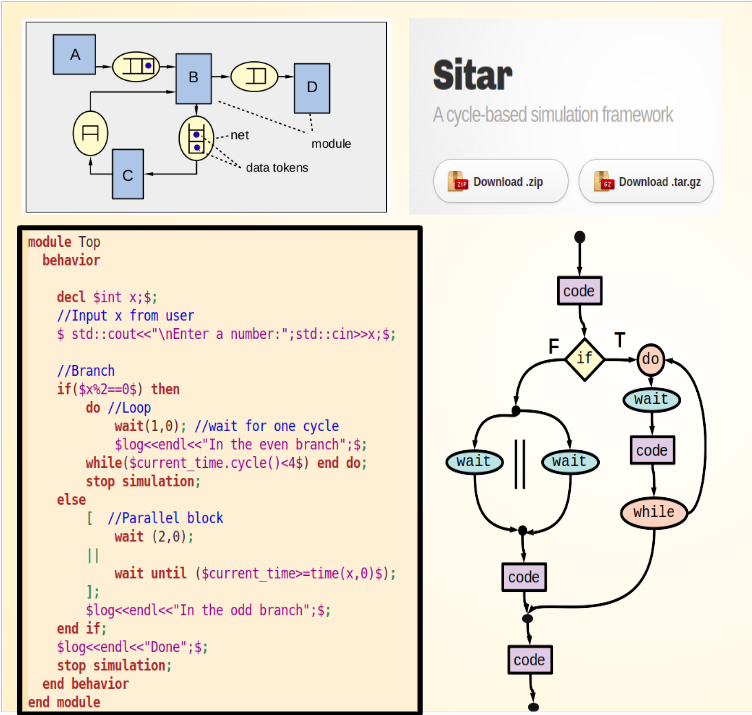

# Sitar Simulation Framework

Sitar is a framework for modeling and parallel simulation of **synchronous (clocked) discrete-event systems**.  

It combines a **domain-specific modeling language** with a **lightweight C++ simulation kernel**, enabling
deterministic and scalable simulation of tightly synchronized systems.

## Target Applications
Sitar is ideally suited for modeling **large and complex synchronous systems with a static interconnection structure**, particularly in domains where system behavior is naturally expressed at discrete time-steps and where scalability and determinism in simulation are critical. Typical application areas include:

- **System-level and computer architecture research models**, such as multi-core processors, memory hierarchies, interconnects, and on-chip networks, where components interact synchronously on a global clock.
- **Computer and communication networks**, including packet-switched networks, mesh and torus topologies, and network-on-chip (NoC) models, where communication latency and buffering semantics are explicitly modeled.
- **Discrete-time queueing networks**, where arrivals, services, and routing decisions occur at fixed time intervals and system state evolves synchronously across components.

By restricting the modeling scope to this class of systems, Sitar enables a simple and efficient simulation algorithm that scales well with model size, while remaining expressive enough for writing very large, complex models.

!!! tip  "Scalability and Performance"
	In single-threaded execution, Sitar’s performance is comparable to that of SystemC. When parallel execution is enabled, speedups of up to **50×** have been observed on a 40-core shared-memory system for large, compute-intensive models.
---
## Core Idea

Sitar models a system as a collection of **modules** that communicate via **nets** (FIFO channels) and evolve in discrete logical time. Each simulation cycle is divided into **two phases**: a *read phase*, in which nets may only be read from, and a *write phase*, in which nets may only be written to. This restriction enforces **race-free and deterministic execution**, and enables parallel simulation by mapping individual modules to separate execution threads that synchronize only at the end of each phase.

<!--
{ width=70% }
-->

This execution model closely follows a **communicating Moore-machine paradigm**, eliminating the need for explicit dependency analysis in the system. A direct consequence of this design is that communication over nets incurs a minimum latency of **one clock cycle**, which is natural for target application domains such as computer architecture and system-level modeling.

To model concurrent components that require *zero-latency* interaction, Sitar provides **parallel blocks**, which allow multiple concurrent behaviors to be grouped within a single module and executed on the same thread with a fixed, deterministic ordering.

Sitar also provides a modeling language with a rich set of constructs, including **fork–join parallelism**, **wait statements**, and control-flow constructs such as **loops** and **conditionals**. These descriptions are translated into efficient, lightweight, user-visible **state-machine code**, conceptually similar to *coroutines in C++* or *generator functions in Python*. This design allows users to focus on **system structure and behavior**, while the framework manages time advancement, scheduling, and deterministic parallel execution.

The simulation kernel itself is intentionally simple and lightweight. This makes it easy to **co-simulate Sitar models with external simulation environments**, by advancing the Sitar model using explicit clock ticks (one per phase, i.e., two per simulation cycle).

---
## Toolchain Overview

A Sitar model is written using the Sitar modeling language and processed through a simple toolchain:

- [x] The model is translated into readable C++ code.
- [x] The generated code is compiled together with the simulation kernel.
- [x] The resulting executable is run in serial or parallel mode.

Parallel execution is supported via OpenMP and can be enabled without modifying the model itself.

## Publications and Slides

To learn more about the design and applications of Sitar, see the following resources:

1. **SIMULTECH 2022 (Best Paper Award)**  
   Foundational paper introducing Sitar and its parallel simulation approach.  
   [`download pdf`](publications/paper1_SIMULTECH2022.pdf)

2. **Winter Simulation Conference 2024**  
   Detailed description of the execution model and performance evaluation.  
   [`download pdf`](publications/paper2_WinterSim2024.pdf)

3. **Tutorial Slides**  
   Overview of key ideas, modeling constructs, and execution semantics.  
   [`download pdf`](publications/2_sitar_tutorial.pdf)

---

## Reopsitory and License
Sitar's Github Repository: [`https://github.com/sitar-sim/sitar`](https://github.com/sitar-sim/sitar)

Sitar is released under the **MIT License**.  
See the `LICENSE` file in the repository for details.

